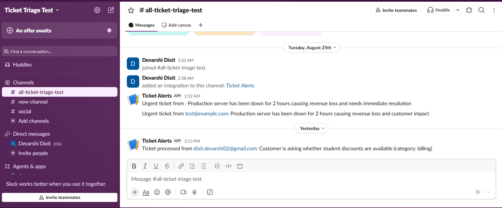

# AI Ticket Triage System

An automated support ticket triage pipeline combining n8n, the Claude API, and a self-trained computer vision model. Incoming emails are automatically classified, drafted a response, checked for security risks, and routed by urgency, with full multimodal support for product photos, screenshots, text PDFs, and scanned documents.

## Architecture

A real email lands in a monitored Gmail inbox, n8n's Gmail Trigger picks it up, and the workflow branches based on whether an attachment is present. Both paths call a FastAPI backend that handles the actual intelligence: Claude classifies the ticket text, and if there's an attachment, a separate routing layer decides what kind of file it is and processes it accordingly before folding the result back into the classification. The ticket is then routed by urgency, urgent tickets post an alert to Slack, everything else is logged.

## What it does

**Text classification.** Every ticket is classified into a category (billing, technical, access, general, urgent) and given a drafted reply, generated by Claude based on the subject and body.

**Product photo inspection.** If an image is attached, Claude first determines whether it's a physical product photo or a software screenshot. Product photos are matched against one of 15 trained categories (from the MVTec AD benchmark) and scored by a self-trained PatchCore + DINOv2 anomaly detection model, the same model built for my separate [visual anomaly detection project](../visual-anomaly-detection). The resulting anomaly score is fed back into the ticket classification, so the drafted reply can reference a confirmed defect instead of asking for a photo that's already been provided.

**Screenshot understanding.** Screenshots are read directly by Claude's vision capability, which describes any visible error messages, error codes, or UI state in plain language, also fed back into classification.

**PDF and scanned document handling.** Text-based PDFs are parsed directly with PyMuPDF. If a PDF has no extractable text (a scanned document), it falls back to Tesseract OCR, rendering each page and reading it. Along the way I hit and fixed a real ligature-corruption bug in PDF text extraction, where "fi" characters were being misread as "6" (e.g. "specific" → "speci6ic"), documented and fixed with a targeted regex.

**Link safety.** Any URL in a ticket body is checked against VirusTotal before the ticket is processed. If a link comes back flagged as malicious or suspicious, the ticket skips normal AI classification entirely and is routed straight to manual security review, no automated reply is drafted for it.

**Urgency routing.** Tickets classified as urgent post an alert to a Slack channel with the customer, summary, and drafted reply attached, so a human can act quickly. Non-urgent tickets are logged with a lighter-weight confirmation message.

## Evaluation

Classification accuracy was measured against a labeled test set of 50 tickets (10 per category), run through the live API, not a mock.

**Result: 46/50 correct (92%)**

The four disagreements were all genuine category boundary cases rather than clear errors:

| Ticket | Expected | Predicted | Why it's defensible |
|---|---|---|---|
| API returning 500 errors | technical | urgent | A production API failure is a reasonable urgency call |
| Session keeps logging me out | access | technical | Login/session issues genuinely straddle both categories |
| Single sign-on not working | access | urgent | "Whole team locked out" reasonably reads as urgent |
| Student discount question | general | billing | A pricing question plausibly belongs in billing |

Full results are in `api/eval_results.json`, reproducible by running `api/run_evaluation.py` against a live instance.

Attachment handling (image routing, PDF/OCR, link checks) is demonstrated qualitatively rather than with a large statistical evaluation, since these paths are largely deterministic once triggered (a fixed anomaly threshold, a binary OCR fallback, a fixed reputation check), so the interesting engineering is in the routing logic itself rather than in re-proving it repeatedly. See the example outputs below.

## Monitoring

The FastAPI backend is instrumented with Prometheus (`prometheus-fastapi-instrumentator`) and visualized in Grafana, tracking request rate, p95 latency, and error rate.

Note: the evaluation's 4 classification "failures" above don't appear as errors here, they're model disagreements, not server errors, every request still returned a valid `200 OK`. Error rate specifically tracks actual server failures (5xx), which stayed at zero throughout testing and evaluation.

## Example outputs

**Product defect detection:** a photo of a damaged bottle was scored 43.9 (threshold ~30) by the trained anomaly model, correctly identified as defective, and the drafted reply referenced the confirmed damage instead of asking for a photo already provided.

**Scanned document OCR:** a photographed (not scanned) product disposal notice was correctly OCR'd end to end, including chemical symbols and regulatory directive numbers, despite real-world lighting and a slight angle.

**Live Slack alerts:**

## Known limitations

- The anomaly detection model only recognizes the 15 MVTec AD product categories it was trained on (bottle, cable, capsule, carpet, grid, hazelnut, leather, metal_nut, pill, screw, tile, toothbrush, transistor, wood, zipper). A photo outside these categories is correctly flagged as unmatched rather than scored, no false confidence.
- Each product category uses its own memory bank; this is standard practice for PatchCore-style anomaly detection but means the system doesn't generalize to arbitrary product types without training a new memory bank per category.
- Scanned PDF OCR is capped at 3 pages per document for demo performance.
- The Gmail integration uses a dedicated test inbox, not a production mailbox.

## Tech stack

Python, FastAPI, SQLite, Claude API (Anthropic), PyTorch, DINOv2, PatchCore, PyMuPDF, Tesseract OCR, VirusTotal API, n8n, Docker, Prometheus, Grafana.

## Running it locally

1. `docker compose up -d` — starts n8n, Prometheus, and Grafana
2. `cd api && uvicorn main:app --reload --port 8000` — starts the FastAPI backend
3. Set `ANTHROPIC_API_KEY` and `VIRUSTOTAL_API_KEY` in `api/.env`
4. Import the n8n workflow and connect a Gmail account via OAuth
5. Grafana at `localhost:3000`, Prometheus at `localhost:9090`, n8n at `localhost:5678`, API docs at `localhost:8000/docs`