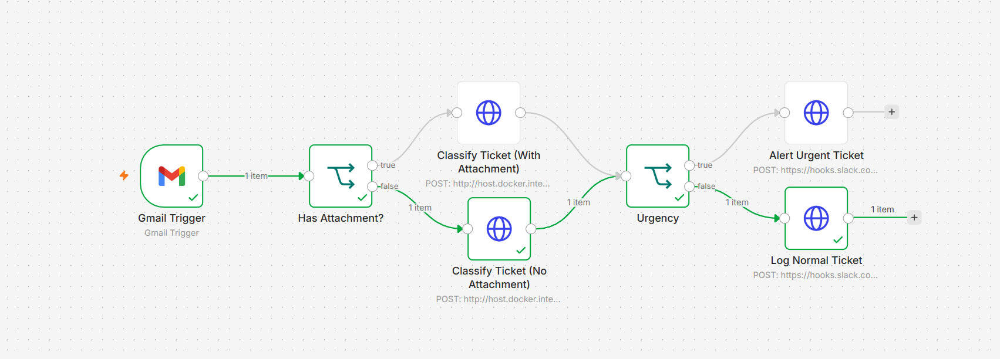
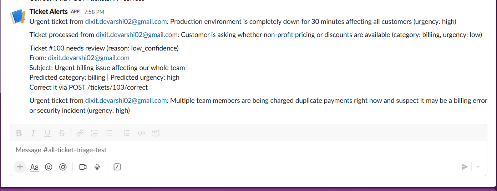
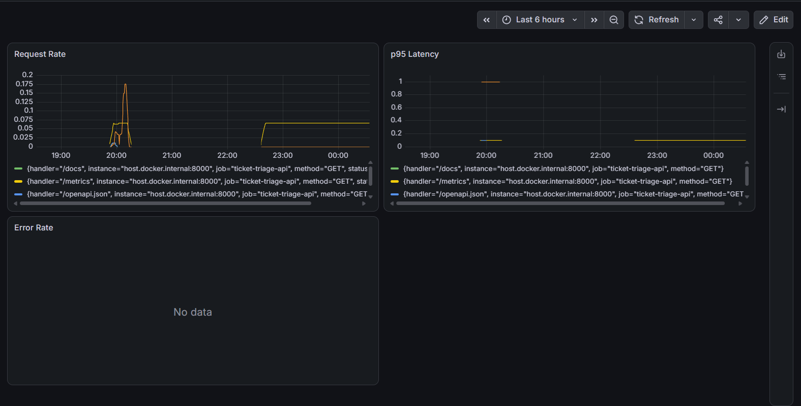

# AI Ticket Triage System

An automated support ticket triage pipeline combining n8n, the Claude API, and a self-trained computer vision model. Incoming emails are automatically classified, assessed for urgency, checked for security risks, and drafted a response, with a built-in human feedback loop and full multimodal support for product photos, screenshots, text PDFs, and scanned documents.

## Architecture

A real email lands in a monitored Gmail inbox. n8n's Gmail Trigger picks it up, and the workflow branches based on whether an attachment is present, both paths call a FastAPI backend that handles the actual intelligence. Claude classifies the ticket's topic and urgency independently, and if there's an attachment, a separate routing layer decides what kind of file it is and processes it before folding the result back into classification. The ticket is then routed by urgency: high-urgency tickets post an alert to Slack, everything else is logged. Separately, any ticket the model isn't confident about, or a small random sample of confident ones, gets flagged for human review, also via Slack.

## What it does

**Independent category and urgency classification.** Every ticket is classified into a topic (billing, technical, access, general) and a separate urgency level (low, medium, high), so a billing question can correctly be low urgency while a billing incident affecting many customers can correctly be high urgency, something a single combined "category" field can't represent. Claude also drafts a reply for every ticket.

**Product photo inspection.** If an image is attached, Claude first determines whether it's a physical product photo or a software screenshot. Product photos are matched against one of 15 trained categories (from the MVTec AD benchmark) and scored by a self-trained PatchCore + DINOv2 anomaly detection model, the same model built for my separate [visual anomaly detection project](https://github.com/dixitdevars/visual-anomaly-detection). The resulting anomaly score is fed back into the ticket classification, so the drafted reply can reference a confirmed defect instead of asking for a photo that's already been provided.

**Screenshot understanding.** Screenshots are read directly by Claude's vision capability, describing any visible error messages, error codes, or UI state in plain language, also fed back into classification.

**PDF and scanned document handling.** Text-based PDFs are parsed directly with PyMuPDF. If a PDF has no extractable text (a scanned document), it falls back to Tesseract OCR, rendering each page and reading it. Along the way I hit and fixed a real ligature-corruption bug in PDF text extraction, where "f" characters (as part of "fi"/"fl" ligatures) were being misread as "6" (e.g. "specific" → "speci6ic"), diagnosed and fixed with a targeted regex.

**Link safety.** Any URL in a ticket body is checked against VirusTotal before the ticket is processed. If a link comes back flagged as malicious or suspicious, the ticket skips normal AI classification entirely and is routed straight to manual security review, no automated reply is drafted for it.

**Confidence-based human review, with a feedback loop.** Every classification includes a self-reported confidence level. Low or medium confidence tickets are automatically flagged for human review and posted to Slack. Since a model can also be *confidently wrong*, a separate mechanism randomly spot-checks 10% of high-confidence tickets too, catching the cases the confidence signal alone would miss. A human corrects flagged tickets through a `POST /tickets/{id}/correct` endpoint, and future similar tickets are given that correction as a few-shot example, so the system's accuracy on recurring ambiguous patterns improves as it's used. In testing, correcting one mislabeled discount/pricing question was enough to make a differently-worded but similar question classify correctly and confidently on the next attempt.

## Evaluation

Classification was measured against a labeled test set of 50 tickets, run through the live API, not a mock. Category and urgency are scored independently, since they're independent fields.

**Category accuracy: 47/50 (94%)**
**Urgency accuracy: 42/50 (84%)**

The category disagreements are genuine boundary cases rather than clear errors, for example a "session keeps logging me out" ticket split between "access" and "technical", and a discount/pricing question split between "billing" and "general", both defensible either way.

Urgency assessment surfaced a real, useful finding during development: the first version of the urgency prompt showed a **systematic bias toward overestimating urgency**, every single wrong prediction skewed higher than expected (low→medium, medium→high), never the other direction. This pointed to the model treating "someone wrote to support" as inherently somewhat urgent, rather than judging actual time-sensitivity. Adding explicit calibration to the prompt (defined tiers, an explicit "default to low" instruction, and an instruction not to inflate urgency just because a customer is writing in) raised urgency accuracy from 64% to 84% on the same dataset, and the remaining errors are now milder (mostly low→medium) rather than systematically skewed.

Full results are in `api/eval_results.json`, reproducible by running `api/run_evaluation.py` against a live instance.

Attachment handling (image routing, PDF/OCR, link checks) is demonstrated qualitatively rather than with a large statistical evaluation, since these paths are largely deterministic once triggered (a fixed anomaly threshold, a binary OCR fallback, a fixed reputation check), so the interesting engineering is in the routing logic itself rather than in re-proving it repeatedly. See the example outputs below.

## Monitoring

The FastAPI backend is instrumented with Prometheus (`prometheus-fastapi-instrumentator`) and visualized in Grafana, tracking request rate, p95 latency, and error rate.

Note: classification disagreements in the evaluation above don't appear as errors here, they're model disagreements, not server errors, every request still returned a valid `200 OK`. Error rate specifically tracks actual server failures (5xx), which stayed at zero throughout testing and evaluation.

## Example outputs

**Product defect detection:** a photo of a damaged bottle was scored 43.9 (threshold ~30) by the trained anomaly model, correctly identified as defective, and the drafted reply referenced the confirmed damage instead of asking for a photo already provided.

**Scanned document OCR:** a photographed (not scanned) product disposal notice was correctly OCR'd end to end, including chemical symbols and regulatory directive numbers, despite real-world lighting and a slight angle.

**Live triage in Slack:** the screenshot above shows four real, distinct outcomes from actual test emails processed through the live pipeline: a pure urgency alert, a routine ticket logged normally, a ticket flagged for review due to low confidence, and a ticket that triggered both an urgency alert and a review flag simultaneously, demonstrating that urgency and confidence-based review are genuinely independent mechanisms.

## Known limitations

- The anomaly detection model only recognizes the 15 MVTec AD product categories it was trained on. A photo outside these categories is correctly flagged as unmatched rather than scored, no false confidence.
- Each product category uses its own memory bank; standard practice for PatchCore-style anomaly detection, but it means the system doesn't generalize to arbitrary product types without training a new memory bank per category.
- Scanned PDF OCR is capped at 3 pages per document for demo performance.
- Confidence-based review only catches tickets where the model itself senses ambiguity. A confidently wrong classification (on either category or urgency) can still slip through undetected; the random 10% spot-check partially mitigates this for high-confidence tickets, but it's probabilistic, not a guarantee.
- The human-correction feedback loop currently improves future classifications through few-shot examples; it does not detect or suppress recurring flagging of the same pattern, a genuinely common ambiguous ticket type will keep getting flagged on each individual occurrence, even after being corrected once, until enough corrected examples accumulate to shift confidence upward.
- The Gmail integration uses a dedicated test inbox, not a production mailbox.

## Tech stack

Python, FastAPI, SQLite, Claude API (Anthropic), PyTorch, DINOv2, PatchCore, PyMuPDF, Tesseract OCR, VirusTotal API, n8n, Docker, Prometheus, Grafana.

## Running it locally

1. `docker compose up -d` — starts n8n, Prometheus, and Grafana
2. `cd api && uvicorn main:app --reload --port 8000` — starts the FastAPI backend
3. Set `ANTHROPIC_API_KEY` and `VIRUSTOTAL_API_KEY` in `api/.env`
4. Import the n8n workflow and connect a Gmail account via OAuth
5. Grafana at `localhost:3000`, Prometheus at `localhost:9090`, n8n at `localhost:5678`, API docs at `localhost:8000/docs`